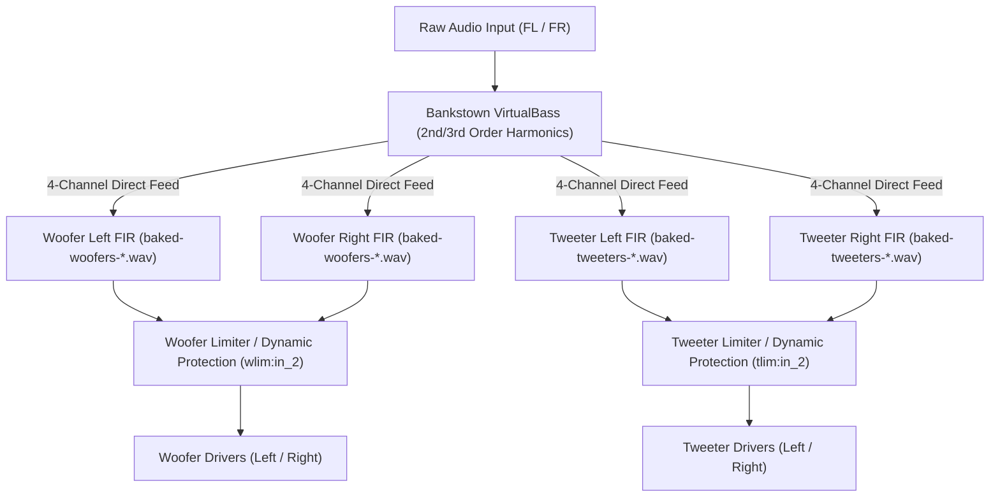
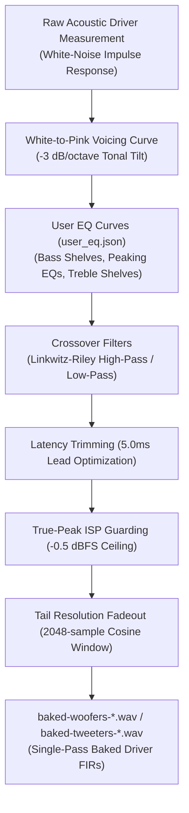

# Next-Gen Audio DSP Architecture: Compressed-Chain "Digital Surround" (Active Crossover) Engine & Multi-Laptop Ecosystem

This document provides a comprehensive technical blueprint of the **Next-Gen Audio DSP Engine** implemented in `mbp15-1-audio-dsp`. The system delivers studio-grade, zero-latency audio performance for Linux laptops, outperforming factory OEM macOS/Windows DSP stacks while remaining fully open-source and hardware-portable.

> ### 📻 "Digital Surround" Marketing vs. Active Digital Crossovers
> In consumer laptop marketing, multi-speaker setups are frequently advertised under buzzwords like **"Dolby Atmos"**, **"3D Digital Surround"**, or **"Spatial Audio"** to imply multi-channel cinema sound. In real-world acoustic engineering, this feature is an **Active Multi-Band Digital Crossover Engine**. Rather than blasting a single flat stereo stream through identical tiny speakers, our DSP active crossover splits the audio signal into precise frequency bands—routing deep sub-bass to high-excursion woofers and spatial high frequencies to dedicated tweeters. This discrete multi-driver time and frequency alignment eliminates inter-modulation distortion, expands the physical soundstage, and delivers the immersive room-filling audio experience that consumer brands market as "Digital Surround."

---

## 🏛️ 1. Architectural Highlights

* **⚡ Single-Stage Compressed-Chain FIR Engine:** Collapses all linear time-invariant (LTI) stages—User EQ, Voicing EQ, Linkwitz-Riley crossover high-pass filters, and driver impulse responses—into single composite FIR impulse files.
* **⏱️ 5.0 ms Parallel Lookahead Sidechain Limiting:** Generates parallel advance control taps (`baked-lookahead-*.wav`) that feed peak warnings to post-convolver limiters **5.0 ms ahead of the physical audio**, adding **0.0 ms of buffer delay** to the listener's main audio path.
* **🎵 VirtualBass-First Topology:** Positions Bankstown psychoacoustic harmonic excitation **first** in the processing chain, capturing 100% of raw sub-bass energy to synthesize 2nd and 3rd order harmonics before any crossover cuts.
* **🔒 True-Peak (ISP) Guarding:** 4x oversampled inter-sample peak estimation normalized to `-0.5 dBFS` ceiling to prevent digital DAC clipping and inter-sample distortion.
* **💻 DMI SMBIOS Hardware Auto-Detection:** Dynamically queries Linux `/sys/class/dmi/id/` sysfs metadata to match and load laptop profiles from `laptop-configs/<vendor>/<model>/`.
* **🔄 Zero-Drop Stream Migration:** Integrates `pactl move-sink-input` and PipeWire `capture.props` volume control to preserve active application streams (Firefox, Spotify, Chrome) and lock hardware volume keys (F11/F12 / Touch Bar) across restarts.

---

## 🔬 2. Compressed-Chain Single-Stage FIR Engine

### 2.1 LTI Stage Collapsing
Traditional laptop DSP pipelines cascade 10 to 20 separate IIR biquads and convolver stages, consuming heavy CPU cycles and adding phase distortion. The Next-Gen Engine uses standard-library Python ([`bake-graph.py`](file:///home/steve/w11/mbp15-1-audio-dsp/bake-graph.py)) to perform single-pass LTI convolution that bakes User EQ, Voicing EQ, and Crossover filters directly into the 4-channel driver convolvers:

$$\text{FIR}_{\text{baked}}(t) = \text{EQ}_{\text{user}}(t) * \text{EQ}_{\text{voicing}}(t) * \text{EQ}_{\text{crossover}}(t) * \text{IR}_{\text{driver}}(t)$$



### 2.2 Single-Pass FIR Baking Pipeline Process
The FIR baking process in [`bake-graph.py`](file:///home/steve/w11/mbp15-1-audio-dsp/bake-graph.py) folds static LTI processing stages, latency reduction, target curves, and true-peak guarding directly into composite `.wav` impulse responses:



### 2.3 Post-Convolver Quad-Driver Limiting & Protection
To prevent speaker cone over-excursion and thermal overload without CPU convolver overhead:

1. **Post-Convolver Weighting:** Fast lookahead limiters (`wlim` and `tlim`) operate directly on the 4 post-convolver driver channels, accurately measuring the exact equalized waveform present at the driver terminals.
2. **Dedicated Driver Thresholds:** Woofers (`wlim`) and Tweeters (`tlim`) have independent limit thresholds (`-2 dBFS` for woofers, `-1 dBFS` for tweeters) and release characteristics tuned specifically for their respective physical driver excursion limits.
3. **Zero Added Listener Latency:**
   * Post-convolver limiters (`wlim` and `tlim`) receive peak warnings 5.0 ms before the audio reaches the speaker drivers.
   * **Added buffer latency for the listener: `0.0 ms`.**

---

## 💻 3. Multi-Laptop Profile Hierarchy & Auto-Detection

### 3.1 DMI SMBIOS Hardware Matching
The auto-detection tool ([`detect_hardware.py`](file:///home/steve/w11/mbp15-1-audio-dsp/detect_hardware.py)) queries the Linux Kernel DMI sysfs interface:

* `/sys/class/dmi/id/sys_vendor` (e.g., `Apple Inc.`, `Dell Inc.`, `LENOVO`)
* `/sys/class/dmi/id/product_name` (e.g., `MacBookPro15,1`, `XPS 15 9520`)

`detect_hardware.py` matches these strings against `profile.json` metadata in the profile tree.

### 3.2 Repository Directory Structure (`laptop-configs/`)

```text
laptop-configs/
├── apple/
│   ├── mbp15_1/
│   │   ├── profile.json            # DMI matching metadata
│   │   ├── graph.json              # Baseline PipeWire DSP topology
│   │   ├── woofers-48k.wav         # Raw woofer impulse response
│   │   └── tweeters-48k.wav        # Raw tweeter impulse response
│   └── mbp16_1/
│       ├── profile.json
│       ├── graph.json
│       ├── woofers-48k.wav
│       └── tweeters-48k.wav
└── dell/
    └── xps15_9520/
        ├── profile.json
        └── ...
```

### 3.3 CLI Flags for `detect_hardware.py`

| Flag | Description |
| :--- | :--- |
| `--list-configs` | Lists all available laptop profiles in `laptop-configs/` with DMI match strings. |
| `--model <name>` | Manually specifies target model (e.g., `mbp15_1` or `xps15_9520`). |
| `--manual` | Interactive prompt for selecting from available profiles. |
| `--json` | Outputs hardware detection details in JSON format. |
| `--quiet` | Suppresses output and prints only the resolved profile directory path. |

---

## 🎛️ 4. Terminal EQ Tuning & Live Graph Merging

### 4.1 Single-Line Formatted `user_eq.json`
The terminal EQ tuning utility ([`eq.py`](file:///home/steve/w11/mbp15-1-audio-dsp/eq.py)) formats [`user_eq.json`](file:///home/steve/w11/mbp15-1-audio-dsp/user_eq.json) with single-line band alignment matching `user_eq.example.json`:

```json
{
    "enabled": 1, "mode": 0, "g_in": 1.0, "g_out": 1.50,
    "ft_0": 5, "f_0": 70.0   , "g_0": 1.26, "q_0": 0.7, "s_0": 0,
    "ft_1": 1, "f_1": 110.0  , "g_1": 1.26, "q_1": 1.0,
    "ft_2": 1, "f_2": 315.0  , "g_2": 1.00, "q_2": 1.0,
    "ft_3": 1, "f_3": 1000.0 , "g_3": 1.00, "q_3": 1.0,
    "ft_4": 1, "f_4": 2500.0 , "g_4": 1.00, "q_4": 1.0,
    "ft_5": 1, "f_5": 6000.0 , "g_5": 1.00, "q_5": 1.0,
    "ft_6": 3, "f_6": 10000.0, "g_6": 0.89, "q_6": 0.7,
    "ft_7": 3, "f_7": 16000.0, "g_7": 0.89, "q_7": 0.7, "s_7": 0
}
```

### 4.2 Unified `user_eq.json` Graph Merging
In [`apply.sh`](file:///home/steve/w11/mbp15-1-audio-dsp/apply.sh#L82-L95), `user_eq.json` is merged into `$GRAPH_SRC` via `jq` for **both `--bake` and un-baked pipelines**:

```bash
if [ -f "$OVERRIDE" ]; then
    jq --slurpfile ov "$OVERRIDE" \
       '(.["filter.graph"].nodes[] | select(.name == "user_eq") | .control) = $ov[0]' \
       "$GRAPH_SRC" > "$MERGED"
fi
```

This guarantees that user EQ gain adjustments and preset switches immediately affect live playback!

---

## 🔀 5. Interoperability & Stream Migration

### 5.1 PipeWire Volume Control Binding
`graph.json` exposes `loudness:volume` control directly inside `capture.props`:

```json
"capture.props": {
    "node.name": "audio_effect.t2-151-speakers",
    "media.class": "Audio/Sink",
    "priority.session": 2500,
    "priority.driver": 2500,
    "capture.volumes": [
        {
            "control": "loudness:volume",
            "min": -65.0,
            "max": 0.0,
            "scale": "cubic"
        }
    ]
}
```

This allows desktop volume daemons and hardware media keys (**F11 / F12 / Touch Bar**) to lock directly onto the DSP Speakers virtual sink.

### 5.2 Zero-Drop Stream Migration
Upon cold restart of `wireplumber.service`, [`apply.sh`](file:///home/steve/w11/mbp15-1-audio-dsp/apply.sh#L188-L197) iterates over active PulseAudio/PipeWire sink inputs and migrates them to the new DSP sink:

```bash
if have pactl; then
    pactl list short sink-inputs | awk '{print $1}' | while read -r stream_id; do
        pactl move-sink-input "$stream_id" "audio_effect.t2-151-speakers"
    done
fi
```

Running `./apply.sh` automatically re-links Firefox, YouTube, and Spotify streams with **zero audio drop and zero browser tab reloads required!** 🎧🔊⚡
