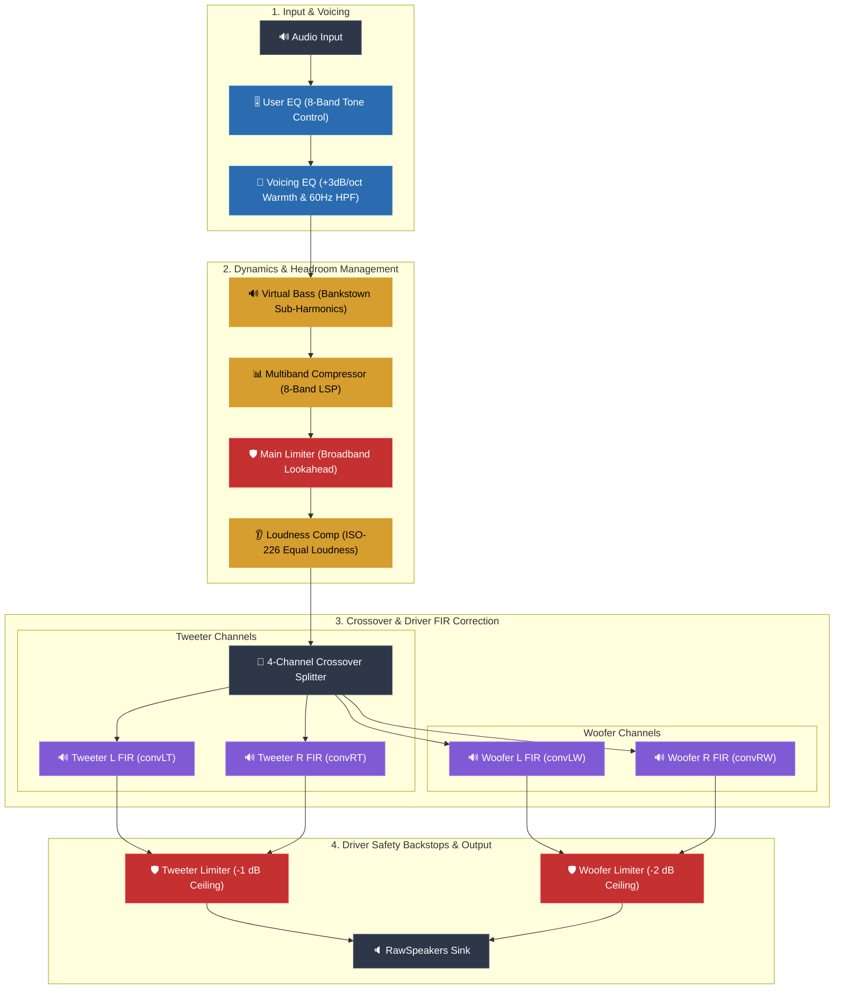

# MacBook Pro 15,1 — Custom Speaker DSP Graph

A high-performance PipeWire `filter-chain` audio DSP graph for the built-in speakers of the **MacBook Pro 15,1** (2018/2019 Intel T2) running Linux (`t2linux`).

> [!NOTE]
> **Not a kernel driver.** This graph connects to WirePlumber's hidden `alsa_output.platform-sound.RawSpeakers` sink, delivering Apple-grade warm voicing, multiband dynamic control, driver crossover, FIR correction, and hard driver safety backstops.

---

## ⚡ Key Improvements Over Upstream

Upstream graphs (`asahi-audio` / `t2-apple-audio-dsp`) target a measurement-flat response that can sound thin, treble-heavy, and distort at high volumes due to missing driver limiters.

| Issue in Upstream | Solution in This Graph | Result |
|---|---|---|
| **Thin / Cold Sound** | +3 dB/octave equal-energy warm voicing curve | Rich, warm, balanced audio at all volumes |
| **Distortion at High Volume** | Post-FIR driver limiters (`wlim` & `tlim`) | Clean output at 100% volume without amp clipping |
| **Woofer Over-Excursion** | 60 Hz high-pass + 8-band multiband compressor | Cone doesn't bottom out on heavy bass beats |
| **No Deep Sub-Bass** | Psychoacoustic sub-bass (`virtualbass` via Bankstown) | Extended perceived low-end without physical strain |
| **Fixed EQ** | Isolated 8-band `user_eq` preference node | Custom tone presets that survive git updates |

---

## 🎛️ Signal Processing Chain

The signal flows through tone controls, dynamic management, ISO-226 loudness tracking, FIR driver correction, and physical driver protection limiters:



---

## 🚀 Quick Start

### 1. Install Dependencies
Installs required LSP & SWH plugins via your distro package manager (`dnf`, `pacman`, `apt`, `zypper`) and builds Bankstown from source:
```bash
./install-deps.sh
```

### 2. Apply Graph
Preflights FIR paths and plugin URIs, builds the effective graph, copies it to WirePlumber, and reloads:
```bash
./apply.sh
```

> [!TIP]
> Ensure the **"MacBook Pro 15,1 DSP Speakers"** sink is selected in your desktop sound settings.

---

## 🎚️ Sound Profiles & User EQ

Customize tone settings without modifying calibrated internal DSP stages. `user_eq` sits at the front of the chain, meaning even aggressive boosts are safely governed by the multiband compressor and limiters.

### Quick Preset Application

1. Copy the example override file:
   ```bash
   cp user_eq.example.json user_eq.json
   ```
2. Edit `user_eq.json` with desired linear gain values (`g_0` through `g_7`) and apply:
   ```bash
   ./apply.sh
   ```

### Recommended Presets

| Preset | 70 Hz (`g_0`) | 110 Hz (`g_1`) | 220 Hz (`g_2`) | 450 Hz (`g_3`) | 1 kHz (`g_4`) | 2.5 kHz (`g_5`) | 6 kHz (`g_6`) | 10 kHz (`g_7`) |
|---|---|---|---|---|---|---|---|---|
| **Reference (Flat)** | `1.00` | `1.00` | `1.00` | `1.00` | `1.00` | `1.00` | `1.00` | `1.00` |
| **Rock / Pop** | `1.00` | `1.26` | `1.00` | `0.94` | `1.00` | `1.12` | `1.19` | `1.12` |
| **Classical / Acoustic** | `1.00` | `1.00` | `1.06` | `1.00` | `1.00` | `1.00` | `1.12` | `1.12` |
| **Electronic / Hip-Hop** | `1.26` | `1.19` | `1.00` | `0.94` | `1.00` | `1.00` | `1.06` | `1.00` |
| **Movie (Dialogue Focus)**| `0.84` | `0.94` | `1.00` | `1.06` | `1.19` | `1.19` | `1.06` | `1.00` |
| **Movie (Action / Bass)** | `1.41` | `1.12` | `1.00` | `1.00` | `1.00` | `1.06` | `1.12` | `1.12` |
| **Late-Night (Low Level)** | `0.63` | `0.79` | `1.00` | `1.00` | `1.06` | `1.12` | `1.00` | `0.94` |

*(Linear values: `1.0` = 0 dB, `1.41` ≈ +3 dB, `0.71` ≈ -3 dB)*

---

## 🛠️ Quick Tuning Reference

If your physical hardware unit needs custom dynamic tuning:

* **Woofer Ceiling:** Edit `wlim.control.limit` in `graph.json` (Default: `-2` dB. Lower to `-3` / `-4` dB for stricter mechanical limiting).
* **Overall Bass Punch:** Adjust `equalizer.control` (`g_1` through `g_5`).
* **Sub-Bass Harmonics:** Adjust `virtualbass.control.amt` (Default: `1.0`).

---

## 📚 Documentation Index

* 📖 **[INSTALL.md](INSTALL.md)** — Comprehensive installation guide, system prerequisites, package manager details, and troubleshooting.
* 🎓 **[README.advanced.md](README.advanced.md)** — Complete electroacoustic design rationale, magnitude-vs-power analysis, gain staging equations, issue tracebacks, and exhaustive parameter tables.
* 📊 **[mb-compressor-params.md](mb-compressor-params.md)** — Port-by-port reference for the 8-band LSP multiband compressor.

---

## 🔄 Reverting to Stock

To return to the stock PipeWire graph provided by `t2-apple-audio-dsp`:
```bash
sudo cp /path/to/t2-apple-audio-dsp/configs/15_1/graph.json \
        /usr/share/t2-linux-audio/15_1/graph.json
systemctl --user restart wireplumber
```
