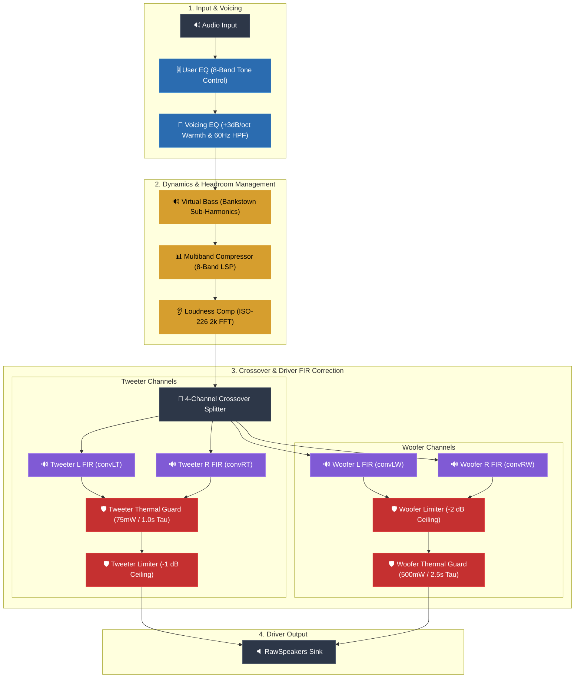

# MacBook Pro 15,1 — Warm, Natural Audio DSP for t2linux


based on https://github.com/lemmyg/t2-apple-audio-dsp/tree/master

[](https://github.com/mynameisdeleted/mbp15-1-audio-dsp) [](https://git.fairfaxmedia.net/t2linux/mbp15-1-audio-dsp.git) [](https://wiki.t2linux.org/) [](https://github.com/AsahiLinux/asahi-audio) [](https://pipewire.org/) []()

A custom PipeWire `filter-chain` DSP graph engineered to deliver warm, natural audio to **t2linux** on the **MacBook Pro 15,1** (2018/2019 Intel T2)—aimed at matching or beating macOS (OS X) audio quality both subjectively and objectively.

> [!NOTE]
> **Architecture:** This is **not a kernel driver**. The Linux T2 kernel/ALSA stack exposes raw speaker PCM. WirePlumber hides the raw device and splices this graph in front of it (`alsa_output.platform-sound.RawSpeakers`), executing warm voicing EQ, psychoacoustic sub-bass, 8-band dynamic control, driver crossover, FIR correction, and hard driver protection limiters.

---

## ⚡ Key Improvements Over Upstream

Upstream graphs (`asahi-audio` / `t2-apple-audio-dsp`) target a measurement-flat response that can sound thin, treble-heavy, and distort at high volumes due to missing driver limiters.

| Upstream Limitation | Solution in This Graph | Real-World Result |
|---|---|---|
| ❄️ **Thin / Cold Sound** | Equal-energy warm voicing curve (+3 dB/octave tilt) | Rich, full, balanced audio across all genres |
| 💥 **Distortion at High Volume** | Post-FIR driver limiters (`wlim` @ -2dB, `tlim` @ -1dB) | Crystal clean output at 100% volume with zero amp clipping |
| 🔊 **Woofer Over-Excursion** | 60 Hz high-pass + 8-band multiband compressor | Woofers don't bottom out or rattle on heavy bass beats |
| 🔇 **No Deep Sub-Bass** | Psychoacoustic sub-bass (`virtualbass` via Bankstown) | Extended perceived low-end without physical cone strain |
| 🛡️ **Voice-Coil Overheating** | Dual Woofer & Tweeter Virtual Thermal Guards | Continuous white noise automatically attenuated to 500mW / 75mW |
| 🎚️ **Fixed / Rigid EQ** | Isolated 8-band `user_eq` preference node | Custom tone presets that survive git updates |

---

## 🎛️ Signal Processing Chain

Audio flows through tone controls, dynamic management, ISO-226 equal loudness tracking, FIR driver correction, and physical driver protection limiters:



---

## 🛡️ Dual-Driver Virtual Thermal Guards & Power Caps

Because Linux cannot access the T2 hardware current-sensing ADCs, we implement a **Virtual Voice-Coil Thermal Model** that models continuous electrical power dissipation ($P = V_{\text{rms}}^2 / R_{\text{vc}}$) and exponential cooling into the air gap:

$$C_{\text{th}} \frac{d\Delta T(t)}{dt} = \frac{V_{\text{rms}}^2(t)}{R_{\text{vc}}} - \frac{\Delta T(t)}{R_{\text{th}}}$$

### Thermal Guard Configurations

* **Woofer Thermal Guard (`thermal_guard` @ Post-`wlim`):**
  * **Continuous Power Cap:** **$500\text{ mW}$ ($0.50\text{ W}$)** per channel ($8\%$ of max $6.25\text{ W}$ peak power).
  * **Linear RMS Threshold (`al`):** `0.282843` ($-10.97\text{ dBFS}$ RMS).
  * **Heating Tau ($\tau_{\text{heat}}$):** $2,500\text{ ms}$ (2.5 seconds).
  * **Cooling Tau ($\tau_{\text{cool}}$):** $5,000\text{ ms}$ (5.0 seconds).
* **Tweeter Thermal Guard (`tweeter_thermal_guard` @ Pre-`tlim`):**
  * **Continuous Power Cap:** **$75\text{ mW}$ ($0.075\text{ W}$)** per channel ($1.2\%$ of max $6.25\text{ W}$ peak power).
  * **Linear RMS Threshold (`al`):** `0.109545` ($-19.21\text{ dBFS}$ RMS).
  * **Heating Tau ($\tau_{\text{heat}}$):** $1,000\text{ ms}$ (1.0 second, faster heating for smaller coil mass).
  * **Cooling Tau ($\tau_{\text{cool}}$):** $2,500\text{ ms}$ (2.5 seconds).

> **Acoustic Result:** Dynamic music (Blues, Classical, Rock) has high crest factor ($12\text{ dB} - 18\text{ dB}$) and operates at $0\text{ dB}$ gain reduction with full peak dynamics. Continuous high-power signals (full-volume white noise or sine sweeps) are automatically attenuated to harmless power levels after ~2 seconds.

---

## 🚀 Quick Start

### 1. Install Dependencies
Installs required LSP & SWH plugins via your package manager (`dnf`, `pacman`, `apt`, `zypper`) and builds Bankstown from source:
```bash
./install-deps.sh
```

### 2. Apply Graph
Preflights FIR paths and plugin URIs, merges user EQ overrides, copies the configuration to WirePlumber, and reloads:
```bash
./apply.sh
```

> [!TIP]
> Ensure **"MacBook Pro 15,1 DSP Speakers"** is selected as the default output in your desktop sound settings.

---

## 🎚️ Sound Profiles & User EQ

Customize tone settings without touching calibrated internal DSP nodes. `user_eq` sits at the front of the chain, so even aggressive boosts are safely governed by downstream multiband limiters.

### Quick Preset Setup

1. **Create your override file:**
   ```bash
   cp user_eq.example.json user_eq.json
   ```
2. **Edit `user_eq.json`** with your preferred gain multipliers (`g_0` to `g_7`) and apply:
   ```bash
   ./apply.sh
   ```

### Recommended Tone Presets

| Profile | 70 Hz (`g_0`) | 110 Hz (`g_1`) | 220 Hz (`g_2`) | 450 Hz (`g_3`) | 1 kHz (`g_4`) | 2.5 kHz (`g_5`) | 6 kHz (`g_6`) | 10 kHz (`g_7`) |
|---|---|---|---|---|---|---|---|---|
| **Reference (Flat)** | `1.00` | `1.00` | `1.00` | `1.00` | `1.00` | `1.00` | `1.00` | `1.00` |
| **Rock / Pop** | `1.00` | `1.26` | `1.00` | `0.94` | `1.00` | `1.12` | `1.19` | `1.12` |
| **Classical / Acoustic** | `1.00` | `1.00` | `1.06` | `1.00` | `1.00` | `1.00` | `1.12` | `1.12` |
| **Electronic / Hip-Hop** | `1.26` | `1.19` | `1.00` | `0.94` | `1.00` | `1.00` | `1.06` | `1.00` |
| **Movie (Dialogue Focus)**| `0.84` | `0.94` | `1.00` | `1.06` | `1.19` | `1.19` | `1.06` | `1.00` |
| **Movie (Action / Bass)** | `1.41` | `1.12` | `1.00` | `1.00` | `1.00` | `1.06` | `1.12` | `1.12` |
| **Late-Night (Low Level)** | `0.63` | `0.79` | `1.00` | `1.00` | `1.06` | `1.19` | `1.00` | `0.94` |

*(Note: Gain values are linear multipliers: `1.0` = 0 dB, `1.41` ≈ +3 dB boost, `0.71` ≈ -3 dB cut)*

---

## 🛠️ Fine-Tuning Guide

If your specific physical unit requires custom acoustic tuning:

* **Woofer Ceiling:** Edit `wlim.control.limit` in `graph.json` (Default: `0` dBFS into `thermal_guard`).
* **Thermal Recalibration:** Edit `al` in `thermal_guard` (`al = sqrt(P_watts / 6.25W)`).
* **Sub-Bass Synthesis:** Adjust `virtualbass.control.amt` (Default: `1.0`).

---

## ⚠️ AT-YOUR-OWN-RISK DISCLAIMER & Replacement Resources

> [!CAUTION]
> **USE AT YOUR OWN RISK:** Loud signals in general, as well as all continuous loud audio (e.g. uncompressed music, white/pink noise, full-volume sine sweeps, or software glitches), carry an inherent physical risk of voice-coil overheating, mechanical over-excursion, or permanent speaker driver damage.
>
> While this DSP engine includes virtual thermal-emulation limiters and dynamic excursion limiters as a **best-effort protective measure**, this software is provided **"AS IS", WITH NO IMPLIED WARRANTY OR GUARANTEE OF ANY KIND**. You are solely responsible for protecting your own hardware and managing playback volume levels. The authors and maintainers assume no responsibility or liability for damaged speaker cones, blown voice coils, or hardware failures.

### 🔧 Speaker Replacement & Repair Resources for Power Users
For expert users who wish to customize thresholds, push thermal limits higher will run a risk of speaker blowout.
Dont increase the limits unless you understand and are prepared for a speaker-driver replacement process at your own risk.
If you wish to replace speaker drivers or to be able to do so yourself  these instructions and part-links may help.
* 🛠️ **iFixit Repair Guide:** [MacBook Pro 15" Touch Bar 2018 Speaker Replacement - iFixit](https://www.ifixit.com/Guide/MacBook+Pro+15-Inch+Touch+Bar+2018+Right+Speaker+Replacement/122784)
* 🛒 **Replacement Speaker Modules:** Cheap OEM speaker assemblies are readily available if you ever push limits and need a fresh set of drivers: search for MacBook Pro 15,1 / 15,2 (A1990 2018/2019) Left & Right Speaker Assemblies on [iFixit Parts](https://www.ifixit.com/Parts/MacBook_Pro_15%22_Touch_Bar) or [eBay A1990 Speakers](https://www.ebay.com/sch/i.html?_nkw=macbook+pro+a1990+speakers).

---

## 📚 Documentation & Repository Links

### 🔗 Repositories & Mirrors
* 🐙 **GitHub Repository:** [github.com/mynameisdeleted/mbp15-1-audio-dsp](https://github.com/mynameisdeleted/mbp15-1-audio-dsp)
* 🏢 **Fairfax Media Git Server:** [git.fairfaxmedia.net/t2linux/mbp15-1-audio-dsp](https://git.fairfaxmedia.net/t2linux/mbp15-1-audio-dsp.git)

### 📖 Guides & Deep Dives
* 📖 **[INSTALL.md](INSTALL.md)** — Full prerequisites, manual plugin build steps, package manager lookup, and troubleshooting.
* 🎓 **[README.advanced.md](README.advanced.md)** — Comprehensive electroacoustic design rationale, magnitude-vs-power physics, gain staging equations, issue tracebacks, and complete parameter reference.
* 📊 **[mb-compressor-params.md](mb-compressor-params.md)** — Detailed parameter guide for the 8-band LSP multiband compressor.

---

## 🔄 Reverting to Stock

To return to the stock PipeWire graph provided by `t2-apple-audio-dsp`:
```bash
sudo cp /path/to/t2-apple-audio-dsp/configs/15_1/graph.json \
        /usr/share/t2-linux-audio/15_1/graph.json
systemctl --user restart wireplumber
```
